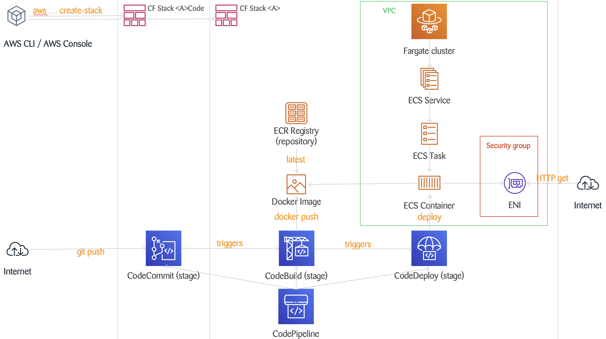

# thorntail-automation with CloudFormation (alpha version)

## Intro

Quick way to start a new thorntail-based (https://thorntail.io/) and AWS Fargate-backed (https://aws.amazon.com/fargate/) project.

First CloudFormation (https://aws.amazon.com/cloudformation/) stack ("&lt;A>Code"):
- New CodeCommit (https://aws.amazon.com/codecommit/) git repository for your new JEE demo app

Second CloudFormation stack  ("&lt;A>"):
- New ECR Repository (docker repository) for your new JEE demo app container
- Your app deployed to a newly created Fargate Cluster (as a service with one task with one container with your app)
- New CI/CD pipeline ("git push" adjusted app sources and your app will be re-reployed) leveraging CodePipeline and CodeBuild

Disclainer: Not ready for production (no error handling, amongst others) => read and understand the scripts & templates before executing them!

## Pre-conditions

- Linux-like environment: Bash, curl, git, sed, ...
- AWS CLI installed and configured (IAM user with ~admin permissions)
- Setup Steps for SSH Connections to AWS CodeCommit Repositories: https://docs.aws.amazon.com/codecommit/latest/userguide/setting-up-ssh-unixes.html?icmpid=docs_acc_console_connect_np

## Setup (-> monthly AWS costs)

Chose a name for "&lt;A>" (lowercase alphanum), e.g. "myhelloworldapp". Then:

    ./create-stacks.sh myhelloworldapp

## Teardown (-> code in CodeCommit repo lost!)

    ./delete_stacks.sh myhelloworldapp

## Big Picture

